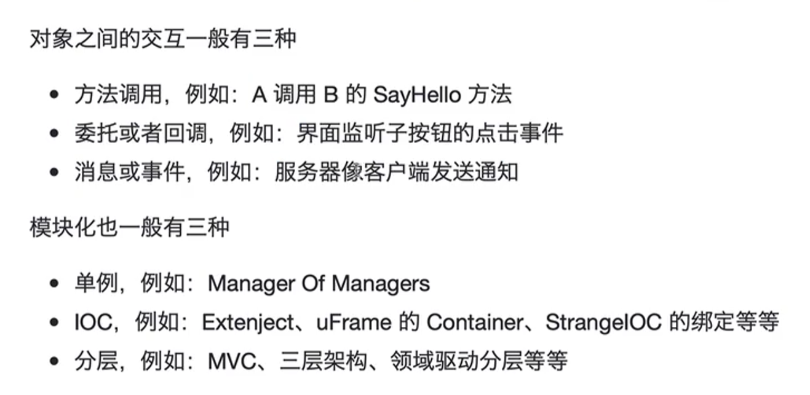
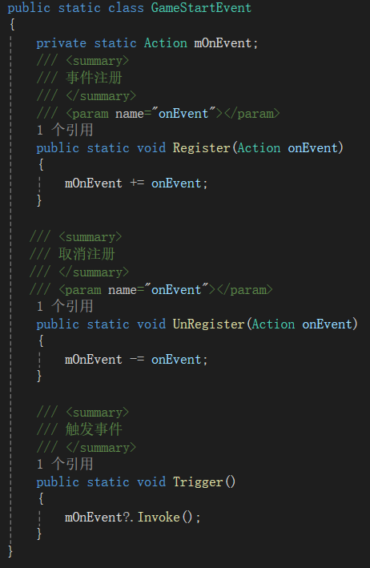
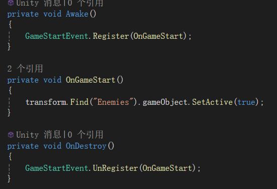
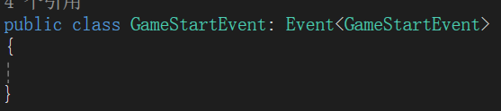
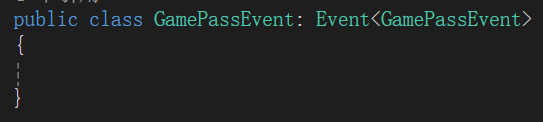

- **对象交互与模块化**

遵循高内聚低耦合的原则。耦合，即对象间的双向引用与循环引用。

使用方法调用进行对象间的交互，则至少是单向引用。

**注意：**父子结点的引用只能是单向的。共识：父节点可以引用子结点而子结点不能引用父节点。子结点调用父节点方法则使用其他交互方式，例如委托或回调。

- **跨模块对象交互**

GameStartPanel的父节点是UI，而Enemies的父节点是Game，直接跨模块调用方法很容易造成问题。

方法调用、委托都需要持有对象，最好的方式就是没有任何引用关系，此时应使用消息&事件进行交互。（事件的注册一般需要在Awake或者Start里进行，若该对象初始为未激活状态，则应该考虑使用始终激活的父节点进行统一管理）

- **事件交互**

创建事件管理类，实现简单的注册、注销、触发

Game模块注册事件

UI模块触发事件，此时UI模块与Game模块没有引用关系，通过事件管理类进行交互

- **重构技巧**

两个事件类GameStartEvent与GamePassEvent两个类的实现代码完全一样，只有**类名或类型**不一样时（未来还会添加各种事件时），使用**泛型 + 继承**来提取。继承解决扩展问题、泛型解决代码一致问题。

泛型基类：

子类：

这段代码定义了一个名为Event的泛型类，其中T是一个类型参数。关键字"where T : Event<T>"是一个约束，指定了类型参数T必须是Event<T>的实例。

这种设计模式在C#中被称为"Curiously Recurring Template Pattern"（奇异递归模板模式，简称CRTP）。在这个模式中，一个类X继承自一个以自己为参数的泛型基类。

这种模式的一个常见用途是在基类中定义一些行为，然后在派生类中进行特化。这样，基类就可以引用派生类的类型，而不是自己的类型或者基类的类型。

例如，这个Event类可能定义了一些关于事件处理的基本行为，然后你可以创建一些派生类（如MouseEvent，KeyEvent等），这些派生类可以继承并特化这些行为。
