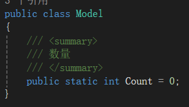
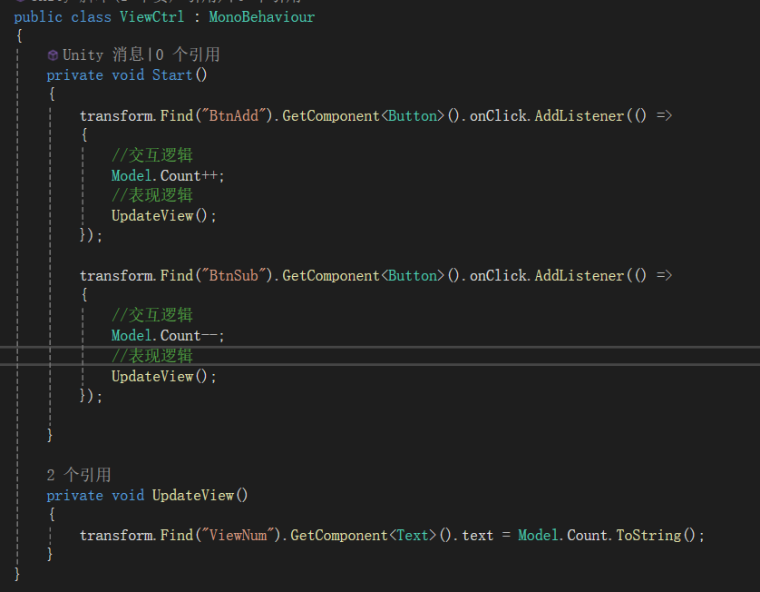
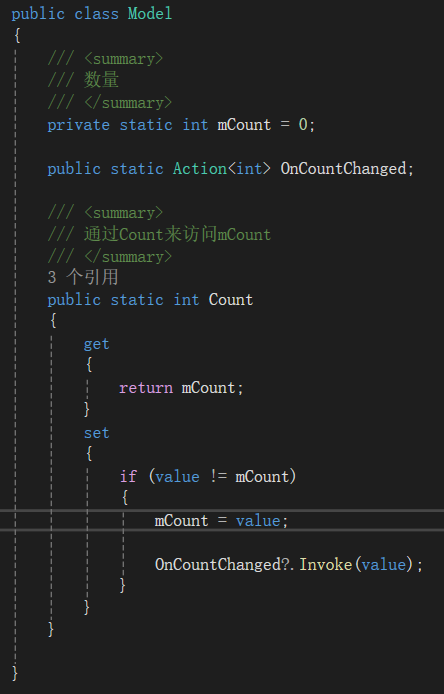
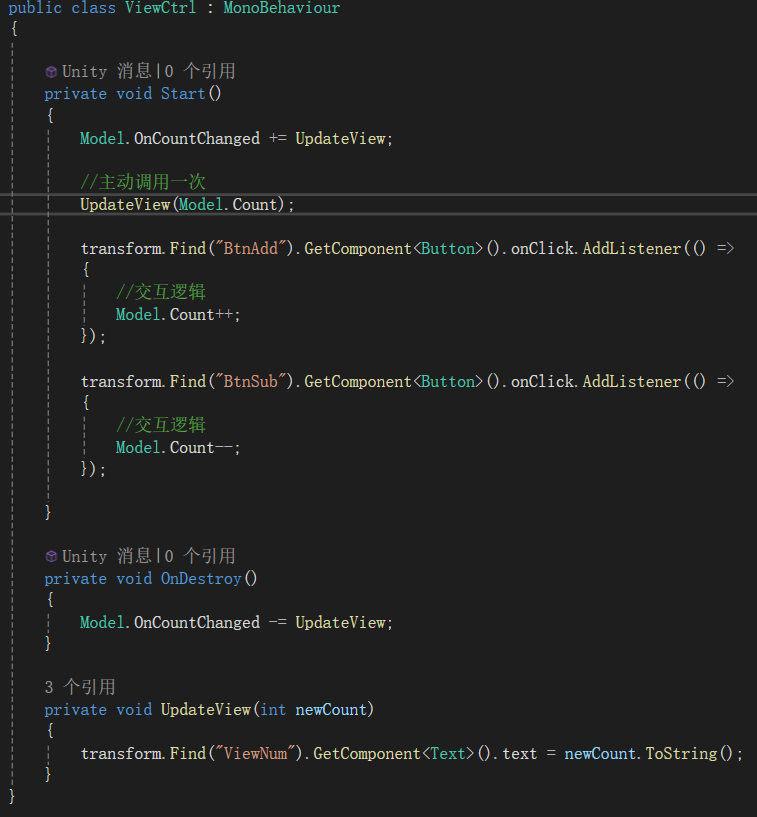

- **目前问题**

- **解决办法**

创建Model类管理数据，将数据与表现分离

 

- **什么数据需要放在Model中**
  
  

- **交互逻辑与表现逻辑简图**

按下+，count++，按下-，count--，最终结果显示在view中

- **代码优化（计数器示例项目）**

1. 方法调用
   
   
   
   
   
   每执行一次交互逻辑，需要主动调一次表现逻辑
2. 委托
   
   
   
   
   
   成员变量: mCount 用于存储 Count 属性的值。
属性: Count 属性通过 get 和 set 访问器来封装 mCount，确保在值发生变化时可以触发事件通知。
事件: OnCountChanged 用于通知外部代码 Count 属性的值发生了变化。
3. 事件
   
    

